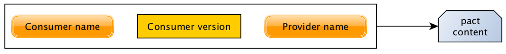
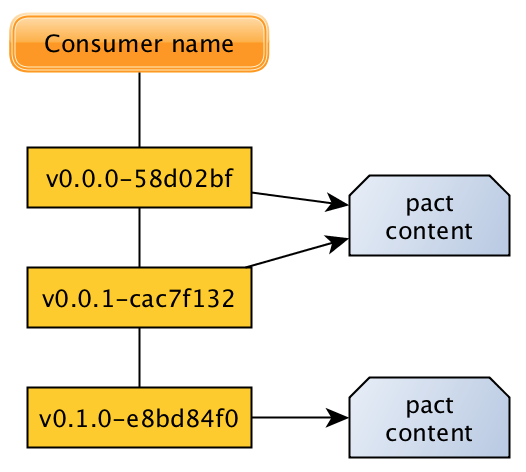
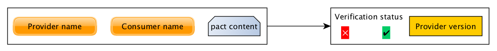
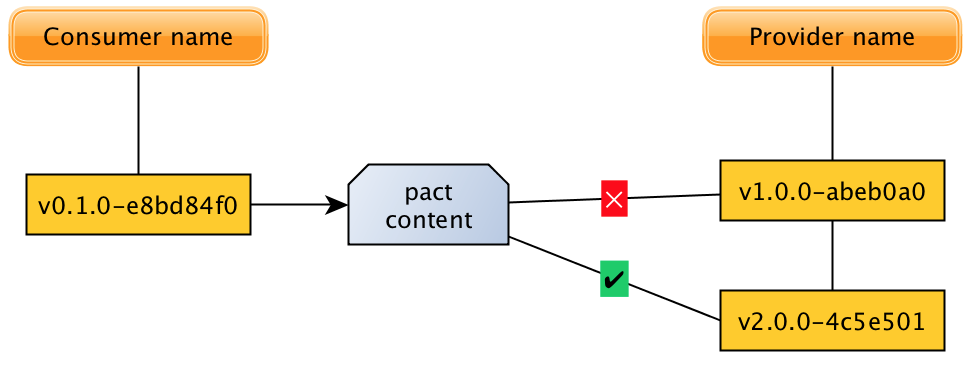
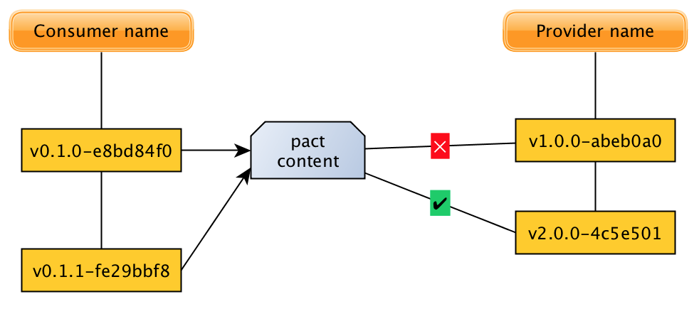
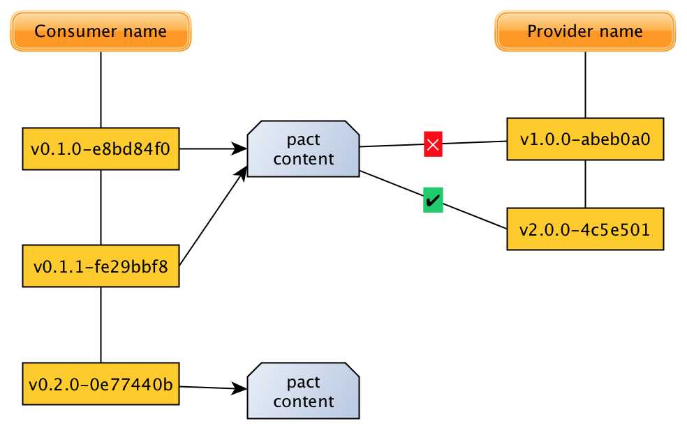
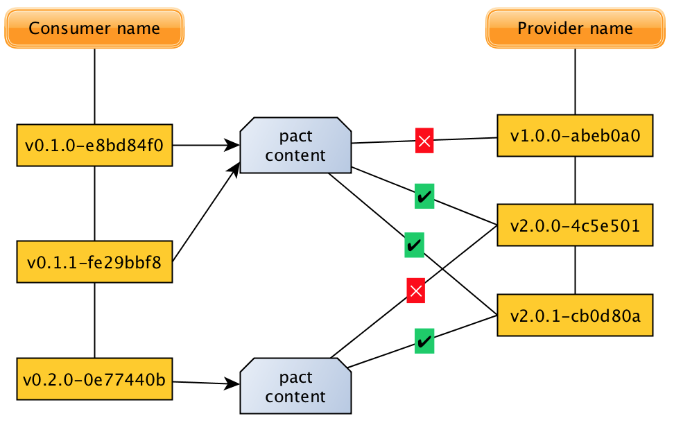

При использовании Pact важно внимательно подходить к назначению версий приложений. В этом документе описываются
принципы версионирования, используемые в Pact Broker, а также приводятся рекомендуемые лучшие практики.

Во избежание состояний гонки номер версии приложения (pacticipant), используемый для публикации контрактов и результатов
верификации, должен либо _быть_, либо _содержать_ коммит (т.е. git SHA или аналог в вашей системе контроля версий).

Концептуально в Pact Broker есть три ресурса, к которым могут применяться версии:

1. Файл контракта (pact-файл)
2. Приложение-потребитель, сгенерировавшее контракт
3. Приложение-поставщик, проверившее контракт

Пользователям Pact не нужно беспокоиться о версиях самих контрактов — это обрабатывается автоматически брокером. Однако
номера версий потребителя и поставщика должны быть заданы осмысленно, даже в препродакшене.

Связанный с этим концепт — **Pact Matrix**, содержащая статус верификации для всех возможных пар версий потребителя и
поставщика, и используемая инструментом [can-i-deploy](../pact_broker/can_i_deploy_ru) для определения безопасности
развёртывания. Следование правилам версионирования pacticipant обеспечит достоверные результаты `can-i-deploy` и поможет
избежать внедрения версий, нарушающих интеграции.

## Версии приложений-потребителей

Когда файл контракта публикуется в брокер, он связывается с определённым именем потребителя, версией потребителя и
именем поставщика:

Версия контракта не совпадает с версией потребителя, который его сгенерировал (версия контракта — это внутреннее понятие
фреймворка и не отображается пользователям).

Удобная особенность Pact Broker — возможность распознавать дубликаты контрактов, позволяя одному контракту принадлежать
нескольким версиям потребителя:

Это происходит, когда две или более версии приложения публикуют один и тот же контракт. Выявление дубликатов
осуществляется через хеширование pact-файла. Заметьте, версии приложения, публикующие одинаковый контракт, не обязаны
быть последовательными.

Позволяя нескольким версиям потребителя указывать на один файл контракта, можно избежать повторной верификации при
отсутствии изменений в контракте. На диаграмме выше поставщик, верифицированный для версии потребителя 0.0.0,
автоматически считается верифицированным и для 0.0.1. Это особенно полезно при работе с фичевыми ветками.

Также это означает, что повторная публикация одного и того же контракта для одной и той же версии потребителя
безопасна — это будет no-op. В таком случае возвращается 200 OK вместо 201 Created.

## Версии приложений-поставщиков

Во время верификации поставщика, его версия связывается с содержимым контракта для данной пары потребитель/поставщик:

Это позволяет брокеру сформировать статус верификации для конкретных пар версий потребителя/поставщика:

Здесь показано, что версия потребителя 0.1.0 совместима с версией поставщика v2.0.0, но не с v1.0.0.

Обратите внимание на разделение между версиями потребителя и поставщика. Верификация Pact выполняется по конкретным
контрактам, а не версиям потребителей. Если публикуется новая версия потребителя с тем же контрактом — верификация не
требуется:

(Здесь опубликована новая версия потребителя, но контракт не изменился, следовательно, она совместима с поставщиком
2.0.0)

Если же публикуется новый контракт — статус верификации неизвестен:

После публикации нового контракта его можно верифицировать на текущей версии поставщика.

Одна версия поставщика может быть верифицирована по нескольким контрактам. Например, после дополнительной верификации
картина может быть такой:

Это означает, что версия поставщика 2.0.0 несовместима с потребителем v0.2.0, тогда как версия 2.0.1 совместима и с
предыдущими, и с новой версией потребителя.

## Порядок версий

Версии приложений (pacticipant) сортируются по *дате создания* ресурса версии. Контракты сортируются по дате создания
соответствующей версии pacticipant.

При верификации часто используется термин "последний контракт" — он доступен по адресу:
`/pacts/provider/{provider}/consumer/{consumer}/latest`, и ссылается на контракт самой последней созданной версии
pacticipant. Добавление `/{tag}` к URL возвращает контракт для самой последней версии pacticipant с заданным тегом. Ни "
последний контракт", ни "последний контракт с тегом" не используют даты создания самого контракта или тега — только дату
создания ресурса версии.

При соблюдении рекомендаций по версионированию, контракт последней версии pacticipant почти всегда будет совпадать с "
самым последним опубликованным контрактом". Если поведение кажется странным — проверьте соответствие рекомендациям.

Повторная публикация контракта для уже существующей версии потребителя не изменит порядок версий или контрактов. Чтобы
заново опубликовать контракт для существующей версии как самый последний, нужно сначала удалить ресурс этой версии — это
удалит все связанные с ней контракты. При соблюдении рекомендаций, такая ситуация возникать не должна.

## Лучшие практики

Рекомендации по версионированию приложений при использовании Pact актуальны и для общего управления версиями. Часто
внедрение Pact требует более строгого подхода к версионированию — необходимого для избежания проблем при развёртывании
микросервисов.

### Правила

1. _Обновляйте версию потребителя при любом изменении контракта или выпуске нового артефакта для деплоя._
    * Для потребителя: новая версия нужна при изменении требований к поставщику.
    * Для поставщика: при изменении поддерживаемого контракта (например, добавлении или изменении API).
2. _Обеспечьте уникальность номеров версий._ Например, фича-ветка с изменениями контракта не должна иметь тот же номер,
   что и другие ветки.
3. _Версии должны быть известны до релиза._ Это важно для использования Pact Matrix при принятии решений о
   развёртывании.
4. Если приложение — и потребитель, и поставщик, используйте одну и ту же версию при публикации контракта и результатов
   верификации. Иначе данные в `can-i-deploy` будут недостоверны.

### Рекомендации

1. Включайте в номер версии указание на конкретный коммит в VCS. **В случае git идеально использовать SHA коммита (
   короткий или полный), или включать его в версию, например: `0.0.10+76a39e5`**:
    * Обеспечивает смену версии при изменении контракта (соответствует правилу 1)
    * Фичевые ветки получают отличные от мастер-ветки номера (правило 2)
    * Версия известна при деплое (правило 3)
    * Легче идентифицировать версию в проде
2. Если нельзя включить git SHA в номер версии — тэгируйте репозиторий уникальной версией во время сборки.
3. Избегайте случайных данных в контрактах — это может привести к созданию уникальных контрактов без реальных изменений
   и лишить возможности использовать механизм распознавания дубликатов.

## Устранение проблем

### При верификации в пайплайне поставщика не находятся контракты потребителя

«Я публикую контракты потребителя с веткой `main`, а верификация поставщика настроена на `{ branch: "main" }`, но
контракты не находятся».

Скорее всего, проблема в том, что приложение является одновременно потребителем и поставщиком, и публикует данные в
PactFlow с недетерминированной версией (например, включающей номер билда).

Сценарий:

* Приложение A — потребитель B, B — потребитель C. То есть B — и потребитель, и поставщик.
* B и C настроены на верификацию контрактов своих потребителей с ветки `main` (`{ "branch": "main" }`).
* У B настроен webhook: при изменении контракта A запускается верификация B.
* При каждом билде номер версии увеличивается _(вот тут и возникает проблема)_.
* B публикует контракт как `B.1`, ветка `main`; затем верифицирует A, публикуя результаты как `B.1`, `main`.
* A публикует новый контракт с версией `A.1`
* Webhook запускает верификацию B, и она публикуется как `B.2`, `main`
    * _Хотя код тот же, что и в `B.1`, теперь PactFlow считает, что это разные версии._
    * В PactFlow последняя версия B с ветки `main` — `B.2`, у которой есть верификация, но нет контракта.
* C запускает пайплайн и пытается верифицировать `main`-версию B — но контракта нет. Зависит от реализации Pact, задача
  либо завершится с ошибкой, либо пройдёт без предупреждения.

**Решение:** использовать детерминированные версии pacticipant, чтобы при webhook-вызовах верификация публиковалась под
тем же номером, что и при обычной публикации контракта.