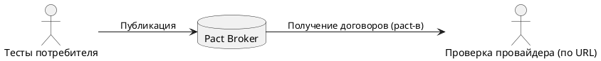
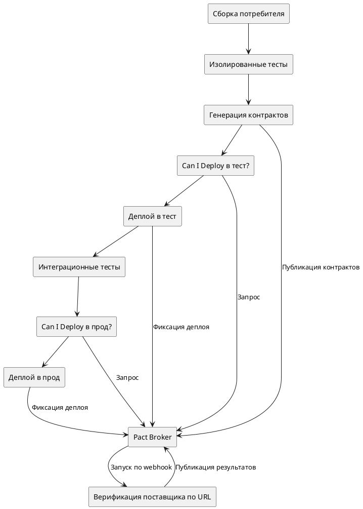
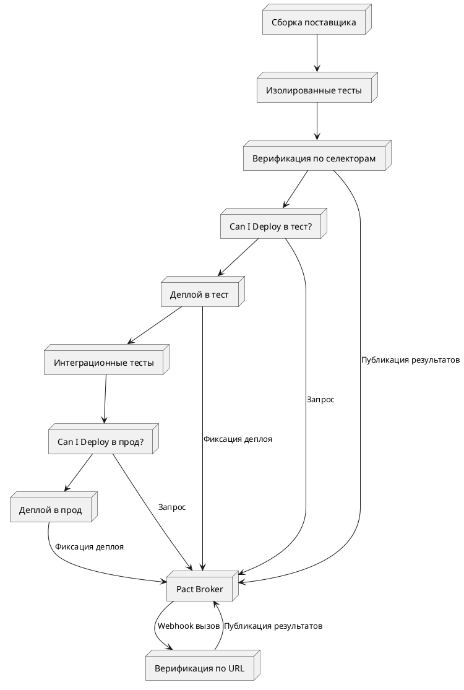

Теперь у вас есть два набора тестов в двух различных кодовых базах. Артефакты, которые их связывают — это Pact-файл и результаты верификации. Следующий шаг — автоматизировать обмен этими артефактами. На этом уровне вы всё ещё запускаете тесты локально, но тест потребителя публикует pact в Pact Broker, а верификацию поставщика вы выполняете вручную — при этом pact загружается по URL, а не из локальной файловой системы. Затем мы создадим новую задачу верификации, которая будет получать тот же pact с использованием селекторов версий потребителя.

  
Диаграмма уровня Silver

### Верификация по URL контракта

### Совместное использование контрактов с командой поставщика через брокер

> Делитесь — значит заботьтесь

Вы написали и выполнили тесты потребителя, в результате чего был создан контракт (pact-файл).
Вы передали его команде поставщика вручную, и они подтвердили, что удовлетворяют всем его требованиям. Теперь нужно устранить ручной этап обмена контрактами, так как это критически важно в условиях эволюции и изменений кода.

Существует несколько способов делиться контрактами, но рекомендуемый способ — использовать **Pact Broker**, сервис, который позволяет проектам автоматически обмениваться контрактами и результатами верификации, создавая мощные автоматизированные пайплайны.

Существуют два варианта:

* [Pact Broker](../pact_broker)

    * Open Source
    * Самостоятельный хостинг

        * Требует развёртывания, администрирования и поддержки
* [Pactflow Broker](https://pactflow.io/?utm_source=ossdocs&utm_campaign=five_minute_guide_dev_plan)

    * Коммерческое расширение open-source брокера
    * Разработан участниками команды Pact
    * SaaS-решение с полной поддержкой
    * Имеет дополнительные функции для упрощения масштабирования и старта

Хотя Pact можно использовать и без брокера, его наличие позволяет в полной мере раскрыть возможности Pact. Без него вам придётся самим организовать цикл обратной связи по результатам верификации, и вы не сможете безопасно и независимо разворачивать сервисы с использованием `can-i-deploy`.

* [Зачем он мне нужен?](https://docs.pact.io/pact_broker#why-do-i-need-one)
* [Можно ли использовать Pact без брокера?](https://docs.pact.io/pact_broker#can-i-use-pact-without-a-pact-broker)

Это руководство предполагает использование Pact Broker или PactFlow Broker.

### Верификация контрактов

Задача верификации должна запускаться в двух случаях:

1. Когда изменяется код поставщика

    * Задача запускается в CI/CD пайплайне поставщика
    * Загружаются и проверяются все актуальные контракты всех потребителей, чтобы убедиться в отсутствии регрессий

2. Когда изменяется контракт

    * Рекомендуется создать отдельный пайплайн верификации поставщика, проверяющий только изменённый контракт (см. шаг 3)

### Пайплайн потребителя

Диаграмма ниже показывает, как может выглядеть полноценный пайплайн потребителя с поддержкой Pact. На этом этапе мы рассмотрим только публикацию контракта. Остальные шаги будут описаны позже.

  
Пайплайн релиза потребителя

### Пайплайн поставщика

Диаграмма ниже показывает возможный пайплайн поставщика. Здесь мы рассмотрим только верификацию и публикацию результатов.

  
Пайплайн релиза поставщика

## Задачи

### A. Настроить Pact Broker

Остальная часть руководства предполагает использование Pact или PactFlow Broker.

#### Pact Broker

> Самый быстрый способ локального запуска — [пример docker-compose](https://docs.pact.io/pact_broker/docker_images/pactfoundation#running-with-docker-compose)
> Также доступны варианты для [OpenShift](https://docs.pact.io/pact_broker/docker_images/pactfoundation#running-with-openshift) и [Kubernetes (Helm)](https://docs.pact.io/pact_broker/kubernetes/readme)

#### PactFlow Broker

> Зарегистрируйтесь на бесплатный Starter Plan [здесь](https://pactflow.io/pricing/?utm_source=ossdocs&utm_campaign=five_minute_guide_dev_plan)

Для целей этого руководства мы не используем специфические возможности PactFlow, поэтому можно начать с него, а затем при необходимости перейти на Open Source Broker.

#### Следующие шаги

Настройте переменные окружения:

* `PACT_BROKER_BASE_URL`
* `PACT_BROKER_USERNAME` # Только для обычного Pact Broker
* `PACT_BROKER_PASSWORD` # Только для обычного Pact Broker
* `PACT_BROKER_TOKEN` # Только для PactFlow

### B. Вручную опубликовать контракт в Pact Broker

Теперь, когда у вас есть Pact Broker, можно начать использовать его для управления взаимодействием между потребителем и поставщиком.

* Следуйте [рекомендованной конфигурации](https://docs.pact.io/consumer/recommended_configuration)
* Используйте один из [CLI-инструментов](https://docs.pact.io/pact_broker/client_cli):

    1. [Docker](https://hub.docker.com/r/pactfoundation/pact-cli)
    2. [Pact Standalone CLI](https://github.com/pact-foundation/pact-ruby-standalone/releases)
    3. [Pact Broker Client (Ruby)](https://github.com/pact-foundation/pact_broker-client)
    4. [Github Actions](https://github.com/pactflow/actions)

Подробности [здесь](https://docs.pact.io/pact_broker/publishing_and_retrieving_pacts#publishing)

Убедитесь, что:

* Pact опубликован
* Указаны правильные имена потребителя и поставщика
* Версия потребителя соответствует git SHA (например, с помощью [absolute-version](https://www.npmjs.com/package/absolute-version))
* Контракт привязан к ветке

Рекомендуется использовать CLI напрямую, а не обёртки, так как последние могут быть устаревшими или неполными.

### C. Вручную проверить контракт по URL

Эта задача выполняется при изменении контракта.

1. Убедитесь, что поставщик может авторизоваться в Broker и получить URL контракта.
2. Измените конфигурацию поставщика, чтобы верификация происходила не по локальному пути, а по URL.
3. Запустите тесты — pact должен быть загружен из Broker и успешно проверен.
4. Этот шаг позже будет использоваться webhook-ами, автоматически запуская проверку при публикации новых контрактов.

Рекомендации: [тут](https://docs.pact.io/provider/recommended_configuration#verification-triggered-by-a-contract-requiring-verification-published)

* Используйте переменную окружения `PACT_URL`
* Устанавливайте флаг `CI` для публикации результатов только из CI
* Всегда указывайте `provider version` и `provider branch`

Попробуйте запуск с `CI=true`, чтобы опубликовать результаты и увидеть зелёный билд в UI брокера.

Убедитесь, что результаты привязаны к версии и ветке поставщика.

### D. Верификация по селекторам версий потребителя

Эта задача выполняется при изменении кода поставщика.

1. Создайте новую задачу верификации с использованием `consumer-version-selectors`
2. Настройте селекторы — например, для главных веток и нужных окружений. [Рекомендации здесь](https://docs.pact.io/pact_broker/advanced_topics/consumer_version_selectors#recommended)
3. Публикуйте результаты только при `CI=true`
4. Указывайте `provider version` и `branch`
5. Запустите задачу — она получит и проверит релевантные контракты

Пример селектора: `{ "mainBranch": true }`. Подробнее о [распознавании главной ветки](https://docs.pact.io/pact_broker/branches#automatic-main-branch-detection)

### E. Поддержка WIP и Pending контрактов

Эта задача также для изменений в коде поставщика.

Включите поддержку Pending и WIP контрактов:

1. Установите `includeWipPactsSince`, например `2023-01-01`
2. Установите флаг `pending: true`

Подробнее: Pending Pacts и WIP Pacts

Если вы автоматически используете feature-ветки, можно отключить WIP-фичу в них, чтобы не пропустить ошибки до полной реализации.

### Примечание

На этом этапе вы публикуете контракты и выполняете верификацию с локальной машины.

В следующем шаге мы покажем интеграцию Pact в CI/CD пайплайн.

Обычно контракты не публикуются с локальных машин, а результаты не отправляются в Broker. Используйте read-only авторизацию, чтобы это обеспечить.
