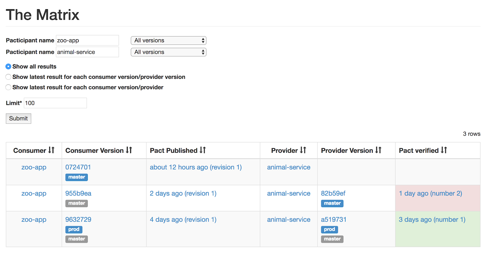
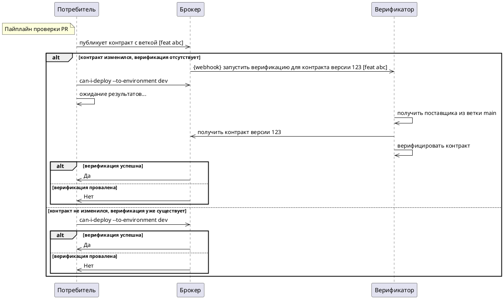

Прежде чем сливать Pull Request, полезно узнать, совместимо ли вносимое изменение с потребителями и/или поставщиками, с
которыми взаимодействует приложение.

Ответить на этот вопрос помогает функция **can-i-deploy** в Pact.

## Матрица

Pact управляет зависимостями с помощью **Pact Matrix** — это матрица, которая создаётся при построении таблицы всех
версий потребителей и поставщиков, протестированных друг против друга с помощью Pact. Вы можете просмотреть матрицу Pact
для любой пары приложений по адресу `/matrix/provider/PROVIDER/consumer/CONSUMER` в вашем Pact Broker.

  
Pact Matrix

### Предварительно проверенные контракты

Важно понимать, что верификация связана с _содержимым_ контракта, а не с конкретной версией потребителя. Это значит, что
если контракт не изменился при повторной публикации, предыдущие результаты верификации автоматически применяются к новой
версии контракта — он считается «предварительно проверенным». \(Поэтому не стоит использовать случайные данные в
контракте — это приведёт к созданию новой ревизии. См. ниже.\)

Связывание верификации с содержимым контракта, а не версией приложения, также позволяет делать «декартово произведение»
контрактов и верификаций, обеспечивая гораздо больше «совместимых» комбинаций.

Чтобы понять, безопасно ли развернуть приложение, нужно определить, существует ли строка в матрице, содержащая версию
приложения, которую вы собираетесь развернуть, и версию другого приложения, уже находящуюся в нужной среде. Это можно
сделать с помощью инструмента [can-i-deploy](../pact_broker/can_i_deploy_ru), описанного ниже.

Необходимость такой проверки возрастает пропорционально времени между выполнением pact-теста и выпуском. Если вы
практикуете непрерывную доставку и сразу после тестов отправляете в прод, вероятность несовместимости минимальна. Но
если между тестом и выпуском проходит много времени — лучше сделать повторную проверку совместимости.

Например, если вы провели верификацию в понедельник, проверив "master" и "production" контракты, а поставщика
разворачиваете только в пятницу — за это время в проде могла появиться новая версия потребителя.

Или контракт был проверен "master"-версией поставщика, но сам поставщик ещё не задеплоен. В таком случае потребителя
нельзя разворачивать в прод до выхода нужной версии поставщика \(если только потребитель не умеет корректно обрабатывать
отсутствие новых взаимодействий — это лучшая практика, хоть и не всегда реализуемая\).

Ещё одна причина необходимости дополнительной проверки «безопасности для релиза» — наличие
функции [pending](../pact_broker/advanced_topics/pending_pacts_ru), при которой изменение контракта не ломает сборку
поставщика. Тогда о проблемах вы можете и не узнать.

## Can I Deploy?

`can-i-deploy` — это CLI-инструмент, который обращается к матрице и определяет, безопасно ли выполнять развертывание.
Подробности его работы описаны [здесь](../pact_broker/can_i_deploy_ru).

В идеале вы хотите узнать, можно ли развернуть в конкретную среду. Но хорошим первым шагом будет проверка совместимости
изменений с текущими версиями потребителей и поставщиков в ветке `main`.

Это полезно, но не идеально — версия контракта в `main` может отличаться от той, что сейчас в staging или production.
Чем чаще и быстрее вы разворачиваетесь, тем меньше вероятность такого рассинхрона, но он возможен.

Особенно это актуально для нативных приложений — старые версии контрактов могут продолжать работать на устройствах
пользователей. Поставщики должны быть совместимы со всеми такими версиями.

В таких случаях проверка совместимости только с `main`-версией потребителя недостаточна. В следующем разделе расскажем,
как проверять совместимость с тем, что действительно развернуто в конкретной среде.

### Добавление `can-i-deploy` в PR-пайплайн потребителя

  
Схема Platinum

Этот шаг немного сложный.

В PR-пайплайне потребителя `can-i-deploy` с веткой `main` проверяет, верифицирован ли данный потребитель против текущей
версии поставщика в его ветке `main`.

Но если потребитель только что сгенерировал и опубликовал новую версию контракта, проверка всегда провалится — поставщик
ещё не успел пройти верификацию против нового контракта.

Чтобы избежать этой ситуации, в Pact Broker нужно зарегистрировать webhook, который будет вызывать задачу верификации
поставщика при публикации нового контракта.

Чтобы `can-i-deploy` заработал в пайплайне PR потребителя, выполните следующие шаги:

* Создайте отдельную задачу CI для верификации поставщика, которую вызывает webhook:

    * Параметры задачи (ветка и коммит позволяют запускать верификацию для развернутых версий на шаге 7):

        * URL изменённого контракта
        * ветка поставщика
        * коммит поставщика
* Добавьте webhook в брокер для вызова этой задачи
* Добавьте шаг `can-i-deploy` в задание проверки PR потребителя:

    * Передайте:

        * имя приложения
        * версию приложения
        * ветку, в которую хотите развернуть (позже это будет среда, шаг 7)
        * можно добавить `--retry-while-unknown` для повторных запросов в ожидании публикации результата верификации

**Примечание:**

Если видите множественные вызовы webhook даже при отсутствии изменений в контракте — убедитесь, что в нём нет случайных
данных. См. [здесь](https://docs.pact.io/getting_started/matching#random-data---avoid-it), почему это важно.

### Добавление новой задачи верификации поставщика

Эта задача выполняет верификацию, принимая URL изменённого контракта и git-коммит/ветку поставщика. Её можно вызвать
через API или другим способом, поддерживаемым вашей CI/CD системой.

1. Создайте CI-задачу, выполняющую только верификацию контракта по URL. Пример конфигурации
   см. [здесь](../provider/recommended_configuration#verification-triggered-by-a-contract-requiring-verification-published).
   Задача должна принимать URL контракта в параметрах HTTP-запроса или теле. Шаблоны webhook для популярных CI систем
   можно
   найти [здесь](https://docs.pact.io/pact_broker/webhooks/template_library#using-the-contract_requiring_verification_published-event-recommended).
   Если нет — см. документацию вашей CI для передачи параметров в сборку. Обратите внимание: если потребитель
   опубликовал неподдерживаемое изменение — сборка упадёт, и это нормально. Не должно быть зависимостей от этой сборки —
   она лишь сообщает результат верификации обратно в брокер.
2. Также CI-задача должна принимать:

    1. git-коммит
    2. git-ветку (по умолчанию — `main`)

Полезно уметь запускать эту задачу вручную, передавая URL контракта, особенно во время настройки и отладки.

### Добавление webhook для can-i-deploy в Pact Broker

После настройки задачи верификации по URL, создайте webhook в Pact Broker:

1. Настройте [webhook](../pact_broker/webhooks_ru), запускающий задачу верификации при изменении контракта.
   Используйте [шаблоны webhook](../pact_broker/webhooks/dynamic_variable_sub) для передачи URL изменённого контракта,
   ветки поставщика и его git SHA в задачу.

Затем добавьте шаг `can-i-deploy` в задачу сборки потребителя.

Примечание: если по техническим или политическим причинам вы не можете использовать webhook, см. альтернативный подход
ниже.

Полезные ссылки:

* [Установка Docker Pact Broker](https://hub.docker.com/r/pactfoundation/pact-broker)
* [Публикация результатов верификации](../pact_broker/advanced_topics/provider_verification_results_ru)
* [Настройка webhook'ов в Pact Broker](../pact_broker/webhooks_ru)
* [Добавление бейджей верификации в README](../pact_broker/advanced_topics/provider_verification_badges_ru)
* [Версионирование в Pact Broker](../getting_started/versioning_in_the_pact_broker)

## Альтернатива: пайплайн без webhook

Если вы не можете использовать webhook (например, из-за ограничений сети), см. пример такого
пайплайна [в этом репозитории](https://github.com/pactflow/example-consumer-webhookless).

## Поздравляем

Теперь у вас есть рабочий процесс, при котором:

* Каждый билд потребителя публикует контракт, привязанный к ветке
* Последняя версия контракта из каждой ветки проверяется при каждом билде поставщика
* Результаты верификации публикуются обратно в брокер
* Любое изменение контракта инициирует верификацию со стороны поставщика

## Следующий шаг — разрешить изменение контрактов без провала сборок

Одна из сложностей consumer-driven подхода — новые взаимодействия часто добавляются в контракт до их реализации на
стороне поставщика. В описанном процессе, при публикации такого контракта запускается сборка поставщика, которая (
правильно) падает при верификации. Это ожидаемое, но нежелательное поведение. Чтобы избежать падений, нужно разрешить
изменения в контрактах, не ломая сборки.
