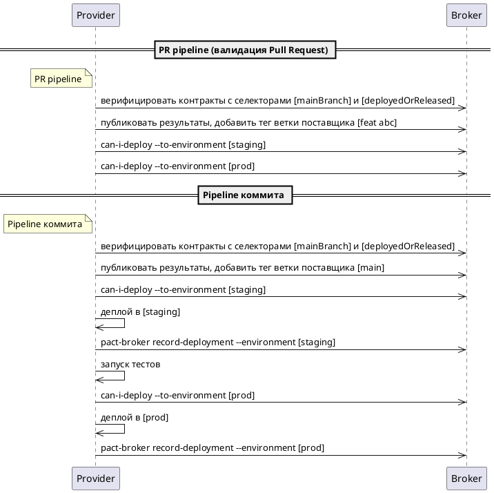
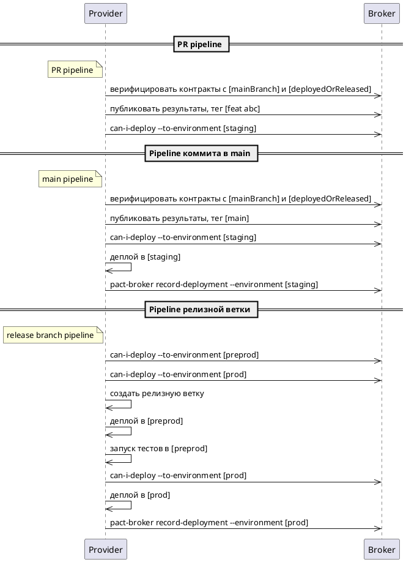

Проверка совместимости вашей пары потребитель/поставщик в последних (head) версиях — это хорошо, но если вы хотите
развёртывать потребителя и поставщика независимо, также необходимо быть уверенным, что последняя версия поставщика
совместима с версией потребителя, находящейся в продакшене. Возможность это делать — одно из ключевых преимуществ Pact.

**Окружения** позволяют обеспечить обратную совместимость между продакшен- и head-версиями ваших приложений: поставщик
может верифицировать контракт, связанный как с последней версией master-ветки, так и с последней версией в продакшене.
Это позволяет реализовать безопасный процесс развёртывания, описанный в шаге 6.

Прежде чем вы развёртываете в продакшн, нужно знать, совместимо ли ваше приложение с уже находящимися там версиями
других приложений. В старой модели такие зависимости решались развёртыванием заранее протестированных наборов приложений
вместе, что создавало узкое место — быстрая разработка одного сервиса могла быть заблокирована более медленным
прогрессом другого.

## Давайте фиксировать развёртывания

Теперь мы готовы сообщать Pact Broker, когда конкретная версия приложения развёрнута, и использовать имена окружений в
`can-i-deploy` вместо имён веток.

  
Диаграмма уровня Diamond

Обратите внимание, что в PR pipeline мы проверяем возможность развёртывания во все окружения, в которые происходит
деплой из `main`. Это делается для того, чтобы в основную ветку не попадали изменения, которые заведомо нарушат
совместимость — мы хотим сохранить её стабильной и избежать блокировок из-за сломанных сборок. Если у вас есть другие
окружения, например `preprod`, их тоже нужно проверять.

Затем, когда мы действительно готовы к развёртыванию в окружение, мы снова запускаем проверку. Это необходимо, потому
что с момента PR-проверки версия другой стороны контракта могла измениться. Проверка в PR уменьшает риск, но не
устраняет его полностью.

Также важно, что первым шагом в pipeline коммита является оповещение брокера о том, что определённая версия потребителя
или поставщика теперь находится в `main`-ветке.

### Добавьте `record-deployment` в commit-пайплайны

Первым делом начните фиксировать развёртывания с помощью `pact-cli`, когда потребитель или поставщик развёртывается в
окружение. Например, при успешном деплое в staging — зафиксируйте это как staging, при деплое в prod — как продакшен.

**Примечание:** Если у вас одновременно развернуто несколько версий приложения, используйте `record-release` — он похож,
но не отменяет развёртывания других версий в окружении.

1. Добавьте шаг в процесс развёртывания, чтобы при деплое потребителя в окружение в Pact Broker фиксировалась его версия
   с указанием имени окружения (например, `test`, `production`). Для этого
   используется [pact broker CLI](../pact_broker/client_cli/readme_ru#record-deployment) (доступен в виде исполняемого
   файла и Docker-образа).
   Также можно использовать API для создания окружений и фиксации релизов/развёртываний —
   документация [здесь](https://docs.pact.io/pact_broker/recording_deployments_and_releases#environments).
2. Используйте селектор `deployedOrReleased` при выборе контрактов, которые поставщик будет верифицировать, например:
   `{ consumerVersionSelectors: { deployedOrReleased: "true" }, { mainBranch: "true"} }`.
   Подробнее о
   селекторах: [consumer version selectors](https://docs.pact.io/pact_broker/advanced_topics/consumer_version_selectors)
3. Используйте одинаковые и согласованные имена окружений во всех приложениях (`prod` или `production`, но не оба).
   Несогласованность приведёт к некорректной работе `can-i-deploy`.

### Добавьте `can-i-deploy` в commit-пайплайны

Когда вы начали тегировать и записывать развёртывания, можно безопасно добавить `can-i-deploy` в пайплайн перед деплоем
в окружение, чтобы убедиться в его безопасности.

### Добавьте `can-i-deploy` по окружениям в PR pipeline

Перед мержем Pull Request проверьте, можно ли развернуть в каждое из окружений, в которые деплой идёт из main:
staging, prod, preprod и т.д.

### А если мы используем релизную ветку?

Если у вас есть релизная ветка, то из `main` вы не деплоите в `prod` или `preprod`, и проверки этих окружений в PR
pipeline не нужны.

Однако перед созданием релизной ветки важно проверить возможность деплоя в `preprod` и `prod`.

Идея такая:

* перед коммитом в ветку, из которой будет происходить деплой, проверьте, можно ли развернуть
* перед самим деплоем в окружение — снова проверьте, можно ли

Это может выглядеть так:

  
Диаграмма уровня Diamond с релизной веткой

### Измените `can-i-deploy` в PR-пайплайнах потребителя и поставщика

Теперь, когда вы фиксируете развёртывания с указанием окружения, можно изменить PR pipeline: вместо проверки деплоя в
`main` проверяйте возможность развёртывания в согласованное окружение.

Поздравляем! Вы полностью внедрили Pact в процесс CI/CD!

Полезные ссылки:

* [Проверка результатов верификации через CLI can-i-deploy](../pact_broker/can_i_deploy_ru)
* [Документация can-i-deploy CLI](../pact_broker/client_cli/readme_ru#can-i-deploy)
* [consumer version selectors](https://docs.pact.io/pact_broker/advanced_topics/consumer_version_selectors)
