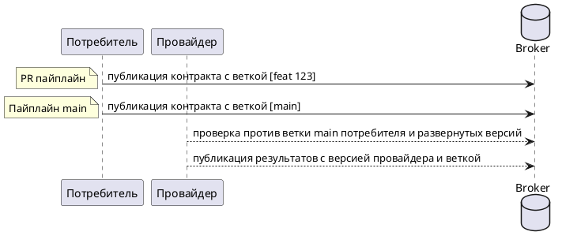
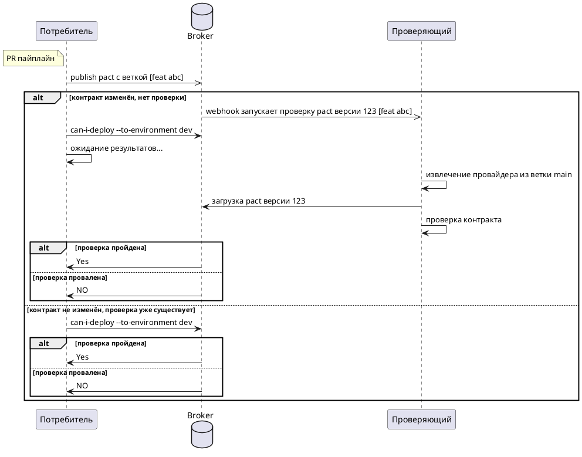
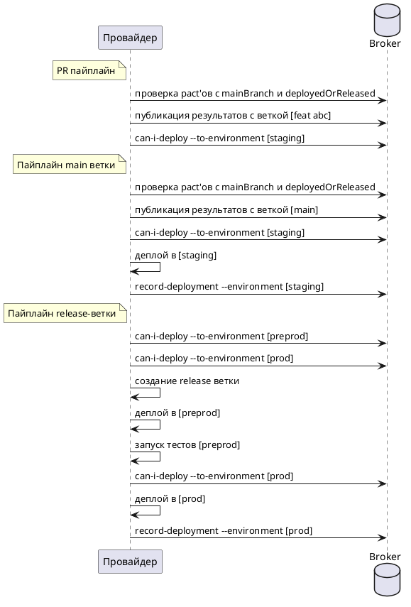

_«Шаги к Пакт-Нирване»_

Это техническое руководство для разработчиков и тестировщиков, желающих использовать Pact для внедрения контрактного тестирования, ориентированного на потребителя, как части текущего CI/CD процесса.

К концу этого руководства вы будете понимать, как создать пайплайн релиза, позволяющий независимо развёртывать любое приложение с уверенностью, что оно будет корректно взаимодействовать с другими приложениями в среде — без необходимости выполнять набор end-to-end тестов.

Это руководство сосредоточено на сценарии, когда и потребитель, и поставщик развёртываются в среду, а не выпускаются конечным пользователям (например, как мобильное приложение). Этот другой сценарий будет рассмотрен отдельно в будущем.

### Как использовать этот документ

Каждая интеграция уникальна. У каждой организации своя история и культура, и у каждой команды — свои процессы разработки, тестирования и развёртывания. Эти различия влияют на выбор наилучшего рабочего процесса Pact.

Тем не менее существует множество общих шагов на пути к полноценной и эффективной настройке Pact (или _«Пакт-Нирване»_). Этот документ описывает эти шаги.

Вы можете выбрать и реализовать только те шаги, которые подходят вашей команде. Возможно, вы остановитесь на первых этапах и будете использовать Pact как дополнение к вашим интеграционным тестам; или полностью откажетесь от последних и достигнете «Пакт-Нирваны».

Это руководство не объясняет подробно, как писать и запускать тесты потребителя или проверки поставщика. Здесь мы рассматриваем стратегию высокого уровня по настройке и использованию Pact. Каждый из приведённых уровней приближает вас к полностью автоматизированному процессу проверки контрактов как части CI/CD без необходимости в интеграционной среде.

Так как Pact реализован на многих языках, здесь излагается теория шагов. Для синтаксиса конкретных задач обратитесь к документации для вашего языка. См. раздел [руководств по реализации](/implementation_guides/cli).

### Какие шаги ведут к Пакт-Нирване?

1. [Подготовка — ознакомьтесь с Pact](pact_nirvana/step_1_ru)
2. [Разговор: достигните согласия в команде](pact_nirvana/step_2_ru)
3. Бронза: вручную создайте и выполните один тест
4. Серебро: вручную интегрируйтесь с Pact Broker
5. Золото: интеграция с PR пайплайнами
6. Платина: добавьте `can-i-deploy` с тегами веток в PR пайплайны
7. Бриллиант: добавьте Pact в пайплайны развёртывания
8. Курс с отличием — в разработке...
   1. Добавление состояний провайдера
   2. Работа с Feature Flags

Ниже представлены диаграммы, соответствующие каждому уровню.

  
Диаграмма: Бронзовый уровень

  
Диаграмма: Золотой уровень

  
Диаграмма: Бриллиантовый уровень

  
Диаграмма: Бриллиант + Release Branch

